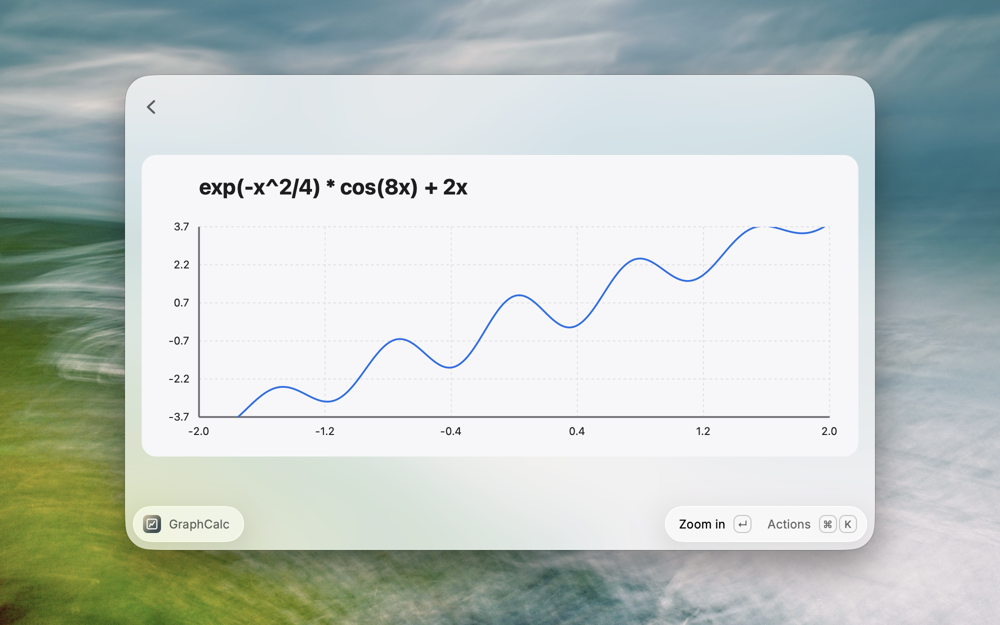
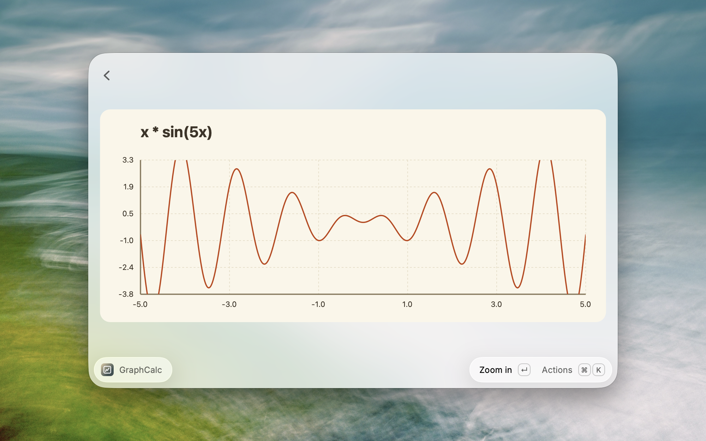
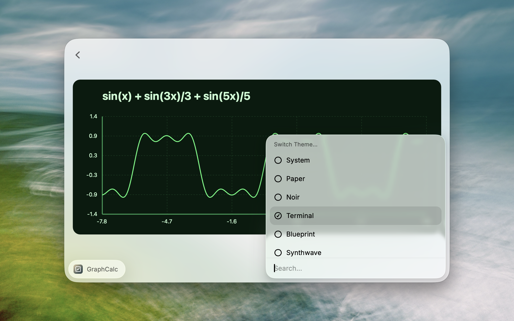

#  GraphCalc

A simple Raycast graphing calculator extension.

## Features

- **Arithmetic Operations**
  - Addition
  - Subtraction
  - Multiplication
  - Division

- **Trigonometric Functions**
  - Sine (`sin(x)`)
  - Cosine (`cos(x)`)
  - Tangent (`tan(x)`)

- **Other Graphing Capabilities**
  - **Interactive Navigation**
    - **Zoom In/Out**: Explore details or view the overall graph.
    - **Pan Left/Right/Up/Down**: Navigate to different regions of the graph.
    - **Reset View**: Quickly reset the graph to default settings.
  - **Themes**
    - The graph draws its own card, so it stays legible on any Raycast theme.
    - Choose from System (follows light/dark), Paper, Noir, Terminal, Blueprint and Synthwave.

- **Equation/Expression History**
  - Keeps track of previously entered equations and expressions for easy access.

## Actions

- **Zoom In/Out**
  - Use actions or keyboard shortcuts to zoom into or out of the graph.
  - **Shortcuts**:
    - Zoom In: `Cmd` + `+`
    - Zoom Out: `Cmd` + `-`

- **Pan Left/Right/Up/Down**
  - Navigate across the graph using actions or keyboard shortcuts.
  - **Shortcuts**:
    - Pan Left: `Cmd` + `Shift` + `←`
    - Pan Right: `Cmd` + `Shift` + `→`
    - Pan Up: `Cmd` + `Shift` + `↑`
    - Pan Down: `Cmd` + `Shift` + `↓`

- **Reset View**
  - Reset the graph to its initial view settings.
  - **Shortcut**: `Cmd` + `Shift` + `.`

- **Themes**
  - Pick a theme from the `Switch Theme` submenu, or cycle with `Next Theme`.
  - **Shortcuts**: Switch Theme `Cmd` + `T`, Next Theme `Cmd` + `Shift` + `;`

- **Share**
  - Copy, paste or save the current graph as a high-resolution PNG (macOS), or copy it as SVG (macOS and Windows).
  - **Shortcuts**: Copy Image `Cmd` + `Shift` + `C`, Paste Image `Cmd` + `Shift` + `V`, Save Image to Downloads `Cmd` + `Shift` + `S`

## Screenshots

## Tech Stack

**Client:** TypeScript, Raycast API

**Math Engine:** [Math.js](https://mathjs.org/)

**Rendering:** Custom SVG generation

## Authors

- [@cluzier](https://www.github.com/cluzier)

